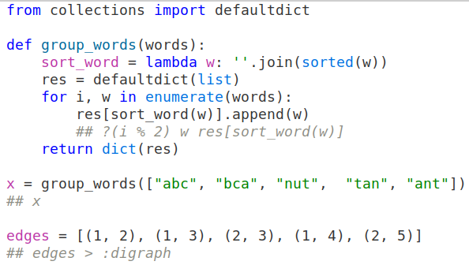
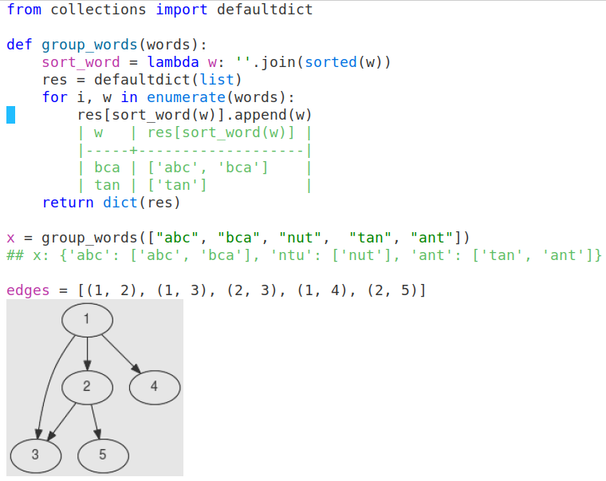

# `interactive overlayer (iove)`
Experimental package which annotates code (only Python right now) with values of specified variables.

## Motivation
The main goal of this package to improve **debugging by printing**. I'm tired of switching to `*Python*` output and matching the code against the values of the variables I'm looking at. Why do this when you can just inline the values?

## Examples
- `a = <something> ##` -- annotate with value of var `a`
- `a, b = <something> ##` -- annotate with values of vars `a` and `b`
- `## a b` -- annotate with values of vars `a` and `b`
- `## ?(a % 2 == 0 and b % 2 == 0) a b` -- annotate with values of vars `a` and `b` only if the condition is met
- `## edges > :graph` -- interpret edges as list of edges and annotate with graph (drawn with dot)
- `## edges > :digraph` -- the same as previous but for directed graph

## Demo





## Usage
``` elisp
(use-package iove
  :quelpa (iove :fetcher git :url "https://github.com/evjava/iove.git")
  :config
  (define-key python-mode-map (kbd "s-l") #'iove/annotate))
```

## References
1. Bret Victor's tells about principle of "immediate feedback" which emphasizes the importance of seeing the effects of code changes as they happen: https://www.youtube.com/watch?v=PUv66718DII&t=1383s
2. Something similar for javascript/typescript: https://quokkajs.com/
3. JetBrains IDE's supports debugger inline watchers: https://blog.jetbrains.com/idea/2020/10/intellij-idea-2020-3-eap-3-debugger-inline-watches-reader-mode-and-more/